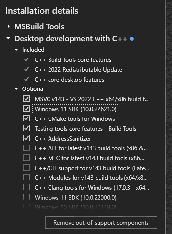

# Improving Customer Experience with Generative AI

## Hackathon Material
* [Challenge Introduction Slides](./challenge_introduction.pdf)

## Running the Example

### Preparation

Please start by installing [Python](https://www.python.org/) and [Pip](https://pypi.org/project/pip/).

#### Windows specific
On Windows you will also have to install [Visual Studio build tools](https://visualstudio.microsoft.com/de/downloads/?q=build+tools) with CMAKE support as shown in the picture:


Now you can install the required Python package for working with LLAMA2:
```
pip install llama-cpp-python
```

If you don't have Pandas installed you will also have to install it:
```
pip install pandas
```

Afterwards you can clone this git repo:
```
git clone https://github.com/Infineon/hackathon
cd hackathon
cd examples
```

### Run the example

Download the `llama-2-7b-chat.Q5_K_M.gguf` LLAMA model (or another one of your choice) e.g. from [here](https://huggingface.co/TheBloke/Llama-2-7B-Chat-GGUF) and type this command to run the example:
```
python llama_example.py
```

### Output
The example takes a random GitHub issue from Infineon's GitHub org and outputs something like:
```
...
------------------------------
Selected issue:
Subject: Question: How to use examples with a particular kit
Request: Trying to use these examples with the Prototyping Kit BT WiFi

Is there some manual configuration that needs to be done on my end or is there a setting that will select the target board?
------------------------------

...
Model output:

Urgency level: 3 (somewhat urgent)
...
```

Of course this is only an example to get one potential workflow running and can still output complete trash - doing it better is your task :)

## Useful Links
* [Infineon Developer Community](https://community.infineon.com/)
* [GitHub issues in Pickle format](./examples/github_issues.pkl)

## Project Submission
:information_source: **Details about submission and deliverables will follow here, soon.**

## Infineon Team

**Eric** (Embedded Systems Engineer)


**Julian** (Staff Embedded Systems Engineer)


### How to reach us?
Please [open an issue](https://github.com/Infineon/hackathon/issues) in this repository to ask your questions or talk to us at the location :)